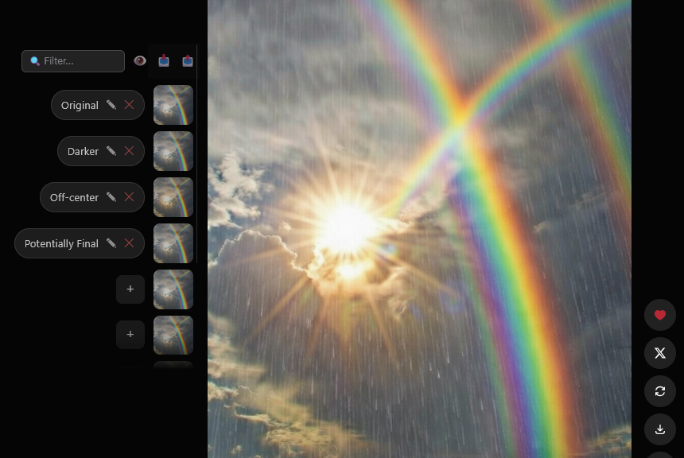

# 🏷️ Grok Moniker

A lightweight UserScript that adds a title management UI to Grok's Imagine carousel. Keep track of your generations with local storage, live filtering, and simple JSON backups.

## ✨ Features

* **Custom Titles:** Add, edit, and delete custom names for your generated images directly within the carousel interface.
* **Live Filtering:** Instantly search through your titled images using the sticky search bar at the top of the gallery.
* **Import/Export:** Backup your library of titles to a JSON file or easily transfer them across different browsers and devices.
* **Toggle Visibility:** Hide the titles sidebar with a single click to restore the native, uncluttered UI whenever you want.
* **Local Storage:** All data is saved securely and entirely within your browser's local storage.

## 📥 Installation

1.  Install a UserScript manager:
    * **Chrome/Edge:** [Tampermonkey](https://www.tampermonkey.net/) or [Violentmonkey](https://violentmonkey.github.io/)
    * **Firefox:** [Violentmonkey](https://addons.mozilla.org/en-US/firefox/addon/violentmonkey/) or [Tampermonkey](https://addons.mozilla.org/en-US/firefox/addon/tampermonkey/)
2.  Install the script directly from [GreasyFork](https://greasyfork.org/scripts/569204) or click the **Install Script** badge above.

## 🛠️ Usage

1. Navigate to Grok Imagine (`grok.com/imagine`) and open a creation.
2. The script will automatically expand the container and add a new sidebar to the left.
3. Click the **+** button next to any image to assign it a title. Press `Enter` or click away to save your text.
4. Use the sticky controls at the top to filter (🔍), hide/show the sidebar (👁️), import (📥), or export (📤) your title database.

*Note: When importing a JSON backup file, the page will automatically reload once the import is successful to immediately apply your restored titles.*

## 🗺️ Roadmap

* Add batch title selection/deletion tools for cleaning up large libraries.
* Implement dynamic width adjustments for better responsiveness on smaller monitor sizes.

***
*Made with 🤍 for the AI art community.*
